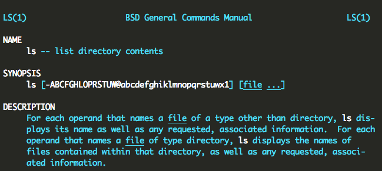

Title: Stern Report
Author: Jin Jay
Date: 2014-08
brief: Stern Report in NEUSOFT东软.
Keywords: Stern

# 实习内容记述

2014年 6月 17号到7月 11号，在大连东软集团实习。

## 实习任务
经过30多个小时的车程后，在18号下午到达了东软集团，路途比较长，下午在安排的员工宿舍休息。在到达东软集团的第二天，见到了实习经理，他给我们介绍了一下此次实习的日程安排：

```
前期学习 Linux环境编程和系统编程。
根据所学制作一款局域网聊天软件或邮件系统。
```

## 实习过程
从到东软的第二天开始，先是学习在 Windows电脑上的 Vmware虚拟机软件中安装 Ubuntu系统。然后是熟悉Linux环境编程。接触到了一些常用命令`ls`, `ps`, `top`, `kill`, `grep`, `find`, `man`, `cd`, `rm`, `cp`, `locate`, `which`, `what`, `whatis`, `where`, `whereis`... 还有管道操作`|`，重定向操作`<`和`>`等等。每一个命令都会使用好几遍以达到熟悉的程度。  
Linux系统编程从介绍 Vim编辑器开始，然后是 gcc编译器的使用， gdb调试工具的使用， makefile的编写，最后是系统函数调用(系统编程)的学习。  
6月 28号开始了小组分配和项目编写。我们小组总共8个人，其中一个项目经理，一个评审负责人，一个配置管理员。我是小组评审负责人，主要负责项目的设计评审、技术点分析，同时还是服务器端的编程人员。小组选择了聊天软件项目。

# 专题内容分析
## Linux环境编程学习
### Shell脚本与常用命令
> man命令  
格式化显示在线操作手册。在实习中遇到不会用的命令还有系统编程时不会使用的函数时，通过man命令能够很快速的找到有用的信息，十分好用。例如：

```
man ls # 查看ls命令的帮助信息
```

> 其他常用命令

```
cd ..           # 改变位置到父目录
cd ~            # 改变位置到用户工作目录
cp file1 file2  # 将文件file1复制到file2
mv file1 file2  # 将文件file1更名为file2
mkdir dir1      # 建立一个目录dir1
rm f*           # 删除当前所有以f开头的文件
rm -r dir1      # 删除目录dir1及其子目录下所有文件
cat file1       # 打印文件内容到屏幕
pwd             # 列出当前所在的目录信息
chmod mode file # 改变文件的读写执行权限
```
### 管道 `|`
*语法：* 命令1 | 命令2  
将命令1的执行结果送给命令2，作为命令2的输入。  
管道使得两个及多个命令可以相互通信，带来了很多的便利。

```
ls -R1 | more   # 以分页的方式列出当前目录及其子目录下所有文件的名称
```
### 输入输出重定向`<` & `>`
*语法：* 命令 `<` 文件  
将文件作为命令的输入。
*语法：* 命令 `>` 文件  
将命令的结果送至指定的文件。  
输入输出重定向便于将操作的结果送入文件或读取文件作为操作的输入。

```
mail -s "theme" xx@email.com < file1 # 将文件file1当做信件内容发给收件人
ls -l > list    # 将”ls -l“的结果写入文件list
```

## Linux系统编程
### Vim编辑器
Vim是从vi发展出来的一个文本编辑器。代码补全、编译及错误跳转等方便编程的功能特别丰富。Vim拥有多种模式，常用有三种：

> 普通模式  
在普通模式中，用的编辑器命令，比如移动光标，删除文本等等。这是Vim启动后的默认模式。常用命令有：

```
j   # 光标向上移动一行
k   # 光标向下移动一行
h   # 光标向左移动一个字符
l   # 光标向右移动一个字符
w   # 光标移到下一个单词词首
e   # 光标移到单词末尾或下一个单词末尾
b   # 光标回退到词首或回退到上一个单词词首
dd  # 删除一行
daw # 删除当前光标所在单词
r   # 替换一个字符
x   # 删除当前光标所在的一个字符
G   # 跳转到文章末尾
gg  # 跳转到文章开头
```


> 插入模式  
在普通模式中，有很多方法可以进入插入模式。常用的方式是按"a"（append／追加）键或者"i"（insert／插入）键。在这个模式中，大多数按键都会向文本缓冲中插入文本。在插入模式中，可以按ESC键回到普通模式。

> 可视模式  
这个模式与普通模式比较相似。但是移动命令会扩大高亮的文本区域。高亮区域可以是字符、行或者是一块文本。当执行一个非移动命令时，命令会被执行到这块高亮的区域上。Vim的"文本对象"也能和移动命令一样用在这个模式中。

```
y   # 复制高亮选中的文本
p   # 粘贴复制在缓冲区的文本
```
> Vim文件配置

```
# 定义F5键用于构建并运行c文件
map <F5> :call Compilerungcc() <CR>
func! Compilerungcc()
exec "w"
exec "!gcc % -o %c"
exec "! ./%<"
endfunc
```
### GCC  
GCC（GNU Compiler Collection，GNU编译器套装），是一套由GNU开发的编程语言编译器。

```
gcc -E hello.c -o hello.i   # 预处理
gcc -S hello.i -o hello.s   # 编译
gcc -c hello.s -o hello.o   # 汇编
gcc hello.o -o hello        # 链接
```
*gcc参数*  
`gcc -I目录 -l链接库 -L链接库路径`

> gcc生成链接库  

```
# 静态链接库
gcc -c source.c -o source.o             # 生成.o文件
ar rcs -o libsource.a source.o          # ar命令将.o文件打包成静态库文件
ar t libsource.a                        # 查看libsource.a包含哪些文件 
# 动态链接库
gcc -c source.c -fpic -o source.o       # 添加-fpic选项生成.o文件
gcc -shared source.o -o libsource.so    # 生成动态链接库
```
### Makefile
> 在软件开发中，make是一个工具程序（Utility software），它是一种转化文件形式的工具，转换的目标称为“target”；与此同时，它也检查文件的依赖关系，如果需要的话，它会调用一些外部软件来完成任务。大多数情况下，make被用来编译源代码，生成结果代码，然后把结果代码连接起来生成可执行文件或者库文件。*makefile*便是make用来确定一个target文件的依赖关系，然后把生成这个target的相关命令传给shell去执行的文件。

```
# makefile预定义变量
$@ 目标名称
$^ 所有被依赖的对象
$< 第一个被依赖的文件
# 模式规则
%.o: %.c  # 将所有的.c文件生成.o文件， %是通配符
# 使用
cc $(CCFLAGS) -c -o $@ $<
```

### GDB调试工具  
GNU调试器(Debugger，缩写：GDB)，是GNU软件系统中的标准调试器。

```
gcc -c source.c -o source -g    # 在编译时使用-g选项
list    # 显示代码
break   # 设置断点
watch   # 观察变量，变量值改变时输出值
print   # 查看变量信息
step    # 在断点时，用于一步一步继续执行，进入函数内部
next    # 在断电时，继续执行但不进入函数内部
```
### 系统编程
`系统编程：`从操作系统获得服务或资源而向内核发起的函数调用。
#### 文件和文件系统  
在Linux系统中一切皆是文件，很多交互工作是通过读取和写入文件件来完成的。  
文件通过inode（信息节点）访问，inode使用唯一的数值（inode编号）进行标识。一个inode存储文件关联的元数据，如它的修改时间戳、所有者、类型、长度以及文件的数据的地址--不包含文件名。目录将易读的文件名与inode编号进行映射。文件名与inode的配对也成为链接（link）。  
用户请求打开一个文件时，内核打开包含指定文件名的目录然后搜索该文件。内核通过文件名获得inode编号，然后根据inode编号找到对应的inode。

```
// open() 系统调用
#include <fcntl.h>
int open (const char *name, int flags, ...);
// flags: O_RDONLY, O_WRONLY, O_RDWR
// 打开文件错误是会返回-1
```

```
// read() 读取文件
#include <unistd.h>
ssize_t read (int fd, void *buf, size_t len);
```
## 项目开发

# 在实习中收获最大与体会最深的内容

# 对实习工作的改进意见
